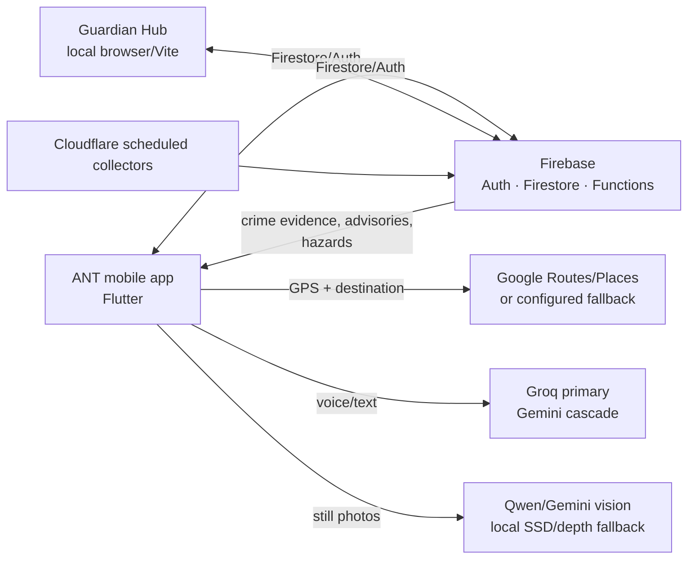

# ANT Application — Overall Technical and User Guide

**Status:** current implementation guide, updated 24 September 2026. This guide describes code in this repository. The numbered module plans and the original [project master plan](../project_master_plan.md) contain useful goals and history, but some names, services, and behaviors in those plans are proposals that have since changed. Where there is a conflict, follow this guide and the linked implementation.

ANT (Assistive Navigational Tool) is a bilingual, voice-first navigation and communication app, primarily for blind and low-vision people in Dhaka. It also supports users with hearing, mobility, cognitive, and anxiety-related needs. It has a paired caretaker role, but location and communication are shared through explicit Firebase records and permissions. This document complements the deeper [Vision and Camera Module](vision_camera_module.md) reference.

## 1. Product shape and architecture

The Android-first mobile app is Flutter. Firebase Authentication and Firestore provide identity, pairing, profiles, communication and safety records. The browser Guardian Hub is a separate TypeScript/Vite client that reads the same Firebase project and data contract. Cloud Functions implement server-side pairing/profile work and route-safety, incident and report aggregation. A Cloudflare Worker periodically collects selected public crime signals and submits them to the Firebase backend.

The app uses one `UserProfile` to drive language, accessibility, saved places, contacts, preferences, and caretaker pairing. `ProviderScope`/Riverpod providers construct shared services; feature screens/widgets present them. Services own network and device integrations. Bilingual English/Bangla strings live in `core/localization` and are used by both visible UI and spoken messages.

### Repository map

| Path | Responsibility |
| --- | --- |
| `ant_app/lib/core/` | Shared providers, configuration, localization, routing, AI, camera, haptics, permissions and utilities |
| `ant_app/lib/features/onboarding/` | Role selection, pairing, accessibility profile, contacts, saved places and preferences |
| `ant_app/lib/features/dashboard/` | User chat, map, navigation display, camera UI, route request, reporting and in-session caretaker messages |
| `ant_app/lib/features/guardian/` | Caretaker mobile dashboard, paired location, alerts, messages, snapshot requests and remote profile functions |
| `guardian_web/` | Browser caretaker companion for local multi-device testing |
| `functions/` | Firebase callable, document-triggered, and scheduled backend functions |
| `cloudflare-worker/` | Scheduled crime-news/social signal collectors and feed tests |
| `firestore.rules` | Firestore access policy; review before changing data models or writing a new client |
| `scripts/release_google_build.sh` | Preflight and release APK build; distribution is a separate explicit command |
| `testing/` | Manual tester scripts and previous round notes |

## 2. The nine product modules

### Module 1 — Onboarding, account and accessibility profile

**What it does:** Selects the supported role (ANT user or caretaker), establishes anonymous Firebase identity, collects accessibility and communication preferences, and optionally pairs the two people. The user interview configures English/Bangla, vision level, mobility aid, hearing, cognitive/anxiety preferences, verbosity, voice, narration behavior, trusted contacts, frequent places, safe havens, depth scanning, map-opening preference and snapshot-consent policy.

**How it works:** Onboarding screens update the Riverpod profile state. `ProfileService` persists profile data. `AuthService` uses Firebase Authentication; `PairingService` manages one-time pairing codes. `UserProfile` serializes supported fields and defaults missing fields when reading older profiles. Phone contacts are searched locally through the platform contacts plugin; only the chosen contact is added to the ANT profile. Manual name/number entry supports voice dictation and reads data back for confirmation.

**Key source:** `features/onboarding/screens/`, `models/user_profile.dart`, `services/profile_service.dart`, `services/auth_service.dart`, `services/pairing_service.dart`, `services/phone_contact_importer.dart`.

**Limits:** Phone address-book search requires the user's permission and a supported device/plugin implementation. Contact entry is not automatically shared to every caretaker. Pairing and profile authorization remain governed by Firestore rules.

### Module 2 — Core UI, localization and user dashboard

**What it does:** Provides a role-aware app shell, accessible onboarding, user split-mode dashboard (conversation and navigation map), caretaker mobile dashboard, Settings, large directional/map elements, text controls, action chips, alerts, reporting and overlays. English and Bangla are supported, with accessibility choices applied throughout.

**How it works:** Flutter widgets consume Riverpod state and invoke feature services. The user's chat composer handles typed and spoken input, camera aiming, caretaker routing, snapshots, quotes, and replayable voice messages. Settings exposes preferences that are also controllable by supported natural-language commands. Map visibility can remain closed after routing for users who prefer voice-first navigation.

**Key source:** `features/dashboard/`, `features/guardian/screens/`, `core/localization/`, `core/theme/`, `core/providers/`.

**Limits:** Screen-reader and device behavior must be verified on real Android hardware. App support for iOS exists in platform files but the current release workflow is Android-first.

### Module 3 — Conversational AI, speech and local voice actions

**What it does:** Converts voice to text, recognizes supported local commands, answers conversational requests with tool/function calls, maintains short conversation context, and speaks responses or navigation cues. It supports English and Bangla and provides deterministic local routing for common commands such as weather, camera, cancel/close, food and bathroom requests.

**Input/output path:** The user taps the microphone, uses the configured wake-word path, or types. `SttService` chooses Cloud STT when configured and falls back to the platform/on-device recognizer. `LocalIntentMatcher` and offline intent logic handle high-confidence phrases without an LLM; other requests go through the assistant service. The `FunctionCallExecutor` applies supported actions (route, settings, overlay, etc.). `TtsService` speaks and queues responses; Cloud TTS is optional, otherwise the device speech engine is used. A narration queue keeps ambient warnings and turn prompts from talking over each other.

**Current assistant order:** GPT-OSS 120B on Groq, then Qwen 3.8 27B on Groq, then Gemma 4 31B and Gemini 3.7 Flash → 3.6 Flash → 3.5 Flash → 3.5 Flash-Lite on AI Studio. Gemma uses its own prompt variant, expanded from the Groq prompt for its smaller stated token budget. Provider/model failures are cooled down and skipped; expired cooldowns restore preferred order. Caching behavior is not described as provider-side prompt caching unless verified at the provider—current reliability behavior is client-side fallback/cooldown and selected response/scene reuse.

**Key source:** `core/services/groq_assistant_service.dart`, `gemini_assistant_service.dart`, `gemini_assistant_cascade.dart`, `gemini_model_cooldowns.dart`, `fallback_assistant_service.dart`, `local_intent_matcher.dart`, `function_call_executor.dart`, `stt_service.dart`, `cloud_stt_service_native.dart`, `tts_service.dart`, `features/dashboard/providers/chat_providers.dart`.

**Limits:** Online model choice, speed and availability depend on key configuration, current provider quotas and network conditions. A model handover may follow a timeout or error, so it can take longer than a healthy primary response. LLM responses are not guaranteed factual; consequential choices should be confirmed with the user.

### Module 4 — Maps, route planning and safety scoring

**What it does:** Searches destinations, compares supported routes, gives turn-by-turn walking instructions, considers hazards/crime advisories, and presents distance, ETA, transit or transport guidance where data is available. Nearby bathroom/food requests can resolve to a nearby category. Emergency destinations bypass ordinary transport clarification. “Take me to X” asks the user's basic transport preference for ordinary trips; “how do I get there?” gives broader travel options. Short trips prioritize a reasonable rickshaw suggestion; medium trips ask before choosing a mode. Bus options are only as complete as the route provider's transit data.

**How it works:** Google Places Autocomplete is used for supported search fields, with legacy geocoding fallbacks. Google Routes is preferred in the tester release where configured; OSM/OSRM fallback remains. Route results normalize to `RouteChoice`/`RouteStep` so `NavigationNarrator` is backend-independent. The app can annotate route choices with crowdsourced hazard zones and thana crime/advisory information. `CommutePlanner` combines route/traffic estimates with walking/rickshaw/CNG/bus estimates, labels approximations, and can include high-confidence weather advisories. API call counters/budget guards are implemented for capped services.

**Navigation runtime:** `NavigationController` subscribes to acceptable GPS fixes, rejects inaccurate or insignificant movement, asks `NavigationNarrator` for the next cue, speaks it, updates progress, and gives the haptic pattern. Bus-stop lookups can run after route startup so a slow lookup does not block the first walking instruction. The map can show a route line and giant directional indicator but need not automatically open for blind profiles.

**Key source:** `core/services/routing_service.dart`, `route_planning_service.dart`, `commute_planner.dart`, `navigation_controller.dart`, `navigation_narrator.dart`, `weather_service.dart`, `route_safety_service.dart`, `features/dashboard/widgets/destination_sheet.dart`, `dashboard_map_panel.dart`.

**Limits:** Google results can omit walking paths, transit line names or fares. Fare and non-car time estimates may be approximations, not live operator quotations. OSM fallbacks have coverage and service availability limits. Maps/Places/Routes credentials and project quota settings must be configured for the intended build.

### Module 5 — Community reporting and hazard aggregation

**What it does:** Lets users report a hazard or incident from a current location and reads nearby/route hazards back to later walkers. It avoids treating one unverified report as a confirmed road closure. Reports can be clustered, counted and decayed; users can resolve a hazard where permitted.

**How it works:** The dashboard's reporting hub gathers a category, details and location. `HazardReportService` writes the report. `onHazardReportCreated` validates/aggregates reports into hazard zones. Scheduled `decayHazardZones` reduces/removes temporary signals as they age. Route safety functions intersect selected route points with active zones. Crime advisories and incident records are separate functions/data from transient street hazards.

**Key source:** `features/dashboard/services/hazard_report_service.dart`, `widgets/crowdsource_reporting_hub.dart`, `functions/lib/hazard_clustering.js`, `hazard_decay.js`, and matching exports in `functions/index.js`.

**Limits:** Reports are community signals, not authoritative ground truth. Automatic camera detection does not silently create a public hazard report. Old module-plan claims about exact report thresholds/decay are historical; current backend thresholds and tests are the source of truth.

### Module 6 — Snapshot vision, camera and ambient scanning

**What it does:** Performs deliberate one-frame scene/sign requests, deliberate camera aiming and image sharing, guided left/ahead/right sweeps, photo follow-up questions, and periodic forward hazard checks for blind/low-vision users. A local SSD detector and optional depth estimate offer limited offline signals.

**How it works:** `SnapshotCamera` serializes access to the device camera. `SnapshotVisionService` captures and checks frames with the local SSD model before an interactive upload, then `VisionRouter` selects Qwen/Gemini by task. Front snaps use one frame and a larger upload cap; guided sweeps send up to three ordered frames to Gemini, with the sharpest single frame sent to Qwen only as a sweep fallback. `AmbientHazardScanner` uses Gemini 3.5 Flash-Lite on one frame at 30-second normal, 15-second near-route-hazard/crossing and 60-second after four clear scans. Ambient frames never enter chat; online timeout/failure falls back to local SSD and optional depth detection. It yields to foreground assistant/camera work and respects movement, lifecycle, profile and battery gates.

**Image upload caps:** Detailed one-frame scan ≤1280×960; sweep and ambient ≤640×480; JPEG quality 86. These are caps, not guaranteed final dimensions or provider token counts. The separate caretaker image attachment path has its own compression logic. See the [Vision and Camera Module](vision_camera_module.md) reference for mechanics and limitations.

**Limits:** One frame cannot prove safety or detect unseen hazards. SSD's object classes are limited; depth is relative rather than a measured distance. Low light, blur, image angle, network and quota affect accuracy. Treat vision as additional information, not a guarantee.

### Module 7 — Haptics and multimodal feedback

**What it does:** Adds a small set of learned vibration cues to voice and visual feedback: navigation turns/confirmation and urgent hazard signals. It lets users configure intensity and throttles repeated hazard alarms.

**How it works:** `HapticsService` maps semantic cues to platform vibration patterns. Navigation and vision use the same service so feedback stays consistent. The app's spoken narration and map/text counterpart remain the primary explanation; a vibration is not intended to encode a full sentence.

**Key source:** `core/services/haptics_service.dart`, onboarding/settings profile controls, `NavigationController`, vision services.

### Module 8 — Virtual Guardian and caretaker communications

**What it does:** Provides a paired caretaker with shared user location (when the app publishes it), alerts, chat, snapshot requests, images and voice memos. User snapshot consent supports automatic approval, never, or asking per request. In ask mode, a request can be held while a foreground task runs and answered by voice or touch. There is no live remote video.

**How it works:** `LiveLocationPublisher` sends updates into Firestore while the app has the needed permission/lifecycle conditions. Caretaker providers/services read profile, `liveLocations`, alert and `communications/{userUid}/messages` documents. Messages identify sender/type and may carry text, JPEG or WAV data. Snapshot requests go through the consent policy and use the user's camera only after permission. The app shows images as messages and can describe incoming photos. Voice messages are tap-to-play in both mobile chat interfaces. The separate `guardian_web/` app uses anonymous Firebase auth, the same one-time pairing code, subscriptions, composer, browser audio, and an OpenStreetMap display.

**Local Guardian Hub test:** from `guardian_web/`, run `npm install` once, then `npm run dev`. Open the localhost URL Vite prints (normally `http://localhost:5173/`), click **Generate pairing code**, and enter it in the mobile app's caretaker pairing flow. Keep the tab open; codes expire after 15 minutes and are single-use. Configure the ignored `guardian_web/.env.local` with Firebase web-app `VITE_` fields first. Localhost is HTTPS-equivalent for browser microphone permissions. This does not need Firebase Hosting or a public URL; Firebase Authentication must allow the local domain and both clients need network access to Firebase. For details see [Guardian Hub README](../guardian_web/README.md).

**Key source:** `features/guardian/`, `features/dashboard/providers/caretaker_inbox_providers.dart`, `widgets/caretaker_inbox_listener.dart`, `features/onboarding/services/pairing_service.dart`, `guardian_web/src/main.ts`, `firestore.rules`.

**Limits:** Location freshness depends on OS permission, GPS, battery, network and app lifecycle. The web build is a local test client; Hosting has no `hosting` entry in root `firebase.json`, so it is not published by this repository's Firebase configuration. Browser storage/profile retains pairing; use a dedicated browser profile for a separate test caretaker.

### Module 9 — Magic Button and emergency support

**What it does:** Offers an emergency trigger through configured physical volume control and supported urgent voice phrases. It can notify trusted contacts/caretaker, share location/status, and offer safe-haven routing through the app's supported online paths.

**How it works:** `EmergencyService` coordinates device trigger, location, messaging and route/navigation integrations. `EmergencyChannel` bridges platform-specific button/battery capabilities. The service writes the relevant alert/communication records and asks the navigation stack to route when the online place/routing path is available. The build script's emergency dispatch mode remains off; tester builds are not automatically authorized to contact real emergency services.

**Key source:** `core/services/emergency_service.dart`, `emergency_channel.dart`, `emergency_config.dart`, guardian alert services, and the platform channel under `android/`/`ios/`.

**Limits:** The original plan described reliable offline SMS/auto-dial and automatic emergency dispatch, but those plan statements must not be taken as proof that every platform/build currently performs those actions. Verify the current `EmergencyConfig`, platform code, permissions and hardware behavior before relying on it. The test release intentionally avoids unexpected real-world dispatch.

## 3. Shared runtime and external services

### Identity, pairing and data

- Firebase Auth supplies app/browser identities; pairing records associate a caretaker with an ANT user's UID.
- Firestore is the shared data store. The main concepts include user profiles, pairing codes, live locations, alerts, communications, hazard reports/zones, route-safety crime zones/advisories/incidents and API usage counters.
- `firestore.rules` is the authoritative access policy. Before adding a collection or browser operation, update and test its rule; do not assume a client-side role check is security.
- Firebase Storage usage varies by message path/build; inspect the current service and rules before changing media size or persistence.

### Speech, AI and quota handling

- `CloudSttService` is preferred when its key/configuration exists; platform recognition is fallback.
- Assistant and VLM model cascades are configured separately. Cooldown state is keyed by provider/model and shared where configured; separate model IDs do not guarantee independent quota pools at the provider level.
- `ApiBudget` tracks configured provider/service usage, but provider consoles remain the authority on project quota and billing.
- Local phrase matching handles known actions deterministically. Complex language falls through to LLM/function calling; fallback responses and device TTS support degraded operation.

### Mapping and routing

- Google Maps Flutter displays the map; Places provides suggestions; Routes provides directions/traffic/transit where enabled.
- OSM/Nominatim/OSRM/Overpass paths are retained as fallbacks or supporting lookups. They have their own usage policies and availability.
- Hazard and crime scoring enriches route choices. It is not a replacement for official emergency guidance or a guarantee of personal safety.

### Backend ingestion and processing

- `functions/index.js` contains callable route checks and recorders, document-triggered user/report handlers, and scheduled decay/ingestion jobs.
- `functions/lib/` contains geographic math, route hazard intersection, report clustering/decay, crime temporal weighting, thresholds, advisories and evidence ingestion.
- `cloudflare-worker/src/collectors/` reads news and social sources on schedules, filters/normalizes evidence and files records through Firebase. It is not part of the mobile APK process.
- `functions/data/` contains seed/geometry/transit reference data. Data quality/freshness should be checked with the repository's health scripts and Firebase state, not inferred from a successful compile.

## 4. Build, run and verify

### Mobile Android app

From `ant_app/`, install dependencies (`flutter pub get`). Provide local secrets through ignored `dart_defines.local.json`; do not commit it. The release workflow is `../scripts/release_google_build.sh verify` followed by `../scripts/release_google_build.sh build`. It sets Google Routes preference plus OSM fallback and tester build switches and validates expected keys/flags in the artifact. `distribute` is a separate command and uploads to Firebase App Distribution; building does not upload.

Run the Flutter suite with `flutter test`. The current suite exercises profile/onboarding, intent matching, provider fallbacks, camera flow/policy, routing, Guardian Hub services, contacts and localization. Run `flutter analyze` after Dart changes; treat analyzer warnings as items to review even if the APK compiler succeeds.

### Guardian Hub local browser

1. Ensure Node.js/npm is installed and Firebase web config is in ignored `guardian_web/.env.local` (`VITE_FIREBASE_API_KEY`, `VITE_FIREBASE_APP_ID`, `VITE_FIREBASE_AUTH_DOMAIN`, `VITE_FIREBASE_PROJECT_ID`, `VITE_FIREBASE_STORAGE_BUCKET`, `VITE_FIREBASE_MESSAGING_SENDER_ID`). The mobile app's web Firebase options can be used as the source for matching project values.
2. From `guardian_web/`, run `npm install` and `npm run dev`.
3. Open Vite's localhost URL in the browser. Anonymous Authentication must be enabled for the Firebase project and localhost allowed as an authorized domain.
4. Generate the one-time code and enter it in the app's caretaker pairing screen. Test paired messages/location, snapshot request consent, image upload and voice memo recording/playback.
5. `npm run build` runs TypeScript project build and Vite production bundling. A bundle-size warning is informational; deployment is not configured in root Firebase Hosting.

The browser app's Firebase web configuration is delivered to the browser by design; Firebase security depends on Authentication, authorized domains, Firestore rules and appropriately restricted API keys, not hiding the web config. Never paste a private server credential or service-account key into this file.

### Firebase backend and worker

Use `functions/package.json` scripts for backend tests and `cloudflare-worker/package.json` for collector tests. Cloud deployment needs the corresponding authenticated CLI/project permissions and backend secrets/config. Read `docs/google_maps_setup.md`, `docs/open_bugs.md` and the relevant package README before changing/deploying. Root `.firebaserc` currently selects `ant-assistive-nav`; root `firebase.json` configures Firestore rules and Functions, not Hosting.

## 5. Security, privacy and operational constraints

- A release APK includes compile-time API keys passed with `--dart-define`; restrict these keys and distribute only to the intended testers. Do not commit local defines or web `.env.local`.
- Raw-transcript diagnostic mode is enabled by the current tester build script. Diagnostic exports may contain speech, names or location context; share privately and exclude raw tester recordings from source commits unless there is a specific approved reason.
- A caretaker sees data only through pairing/rules and what the user app publishes. Snapshot requests are mediated by the profile's consent mode; ordinary user/caretaker image messages remain separate from remote camera permission.
- The browser caretaker tool is a multi-device testing companion, not an independent emergency dispatch service.
- Predictions from vision, crime data, community reports, Google route ETAs, estimated fares and weather should be presented with their uncertainty. Test on representative devices, network conditions and real walking routes before depending on them.

## 6. Source-of-truth and follow-up

- Overall implementation guide: this file.
- Camera/VLM detail: [Vision and Camera Module](vision_camera_module.md).
- Current tester changes: [Round 4 release notes](release_notes_round4.md).
- Current deferred product work: [Backlog](../BACKLOG.md).
- Local browser setup: [Guardian Hub README](../guardian_web/README.md).
- Historical design intent: `01_module_plan_*.md` through `09_module_plan_*.md` and `project_master_plan.md`; check implementation when old plan language names a model/API or promises behavior.
