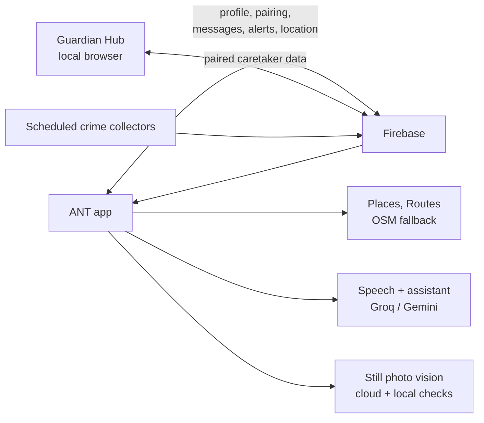

# ANT: A Guide to the App

**Updated 24 September 2026.** This guide explains ANT feature by feature: what a person can do, what the app does in response, and where each feature has limits. It is based on the current code. Some older plans describe ideas that changed; see [Notes for people working on ANT](#notes-for-people-working-on-ant) at the end.

ANT is a bilingual (English and বাংলা) navigation and communication app, built mainly for blind and low-vision people in Dhaka. It can also adapt to hearing, mobility, anxiety, and cognitive needs. A trusted person can connect as a caretaker through the mobile app or the Guardian Hub in a computer browser.

## Using ANT, feature by feature

### 1. Set up ANT for the person using it

**What you can do:** Choose whether you need assistance or are a caretaker. For an ANT user, answer a guided set of questions about language, vision, mobility, hearing, preferred amount of detail, speech, contacts, places, and safety preferences.

**What ANT does:** Saves those choices in the user's profile and uses them to shape later screens, voice prompts, map behavior, and scanning. You can search the phone's contacts or add a name and number yourself. Both methods support voice input. The app reads important information back so it can be checked before saving.

**Caretaker pairing:** A caretaker generates a one-time code. The ANT user enters that code to link the accounts. The pairing code expires after 15 minutes and can only be used once.

**When it works:** Contact search needs permission to read the phone's contacts. Pairing and profile sharing need an internet connection.

### 2. Talk to ANT or type a request

**What you can do:** Speak, type, use the configured wake-word option, or choose an on-screen shortcut. Requests can be conversational (“what's the weather?”) or ask ANT to take an action (“open the camera”, “take me to the nearest bathroom”).

**What ANT does:** Converts speech to text, checks whether the request matches a supported direct command, and uses an AI assistant for questions that need broader language understanding. The assistant can call app actions such as starting a route or changing supported settings. ANT reads replies aloud and shows them in the conversation. English and Bangla are supported.

**AI backup:** The current chat lineup tries Groq models first—GPT-OSS 120B, then Qwen 3.8 27B—followed by Gemma 4 31B and Gemini Flash models. If a model reports a limit or service problem, ANT can skip it temporarily and try the next available model. After the cooldown, the preferred model can return to the front of the line.

**When it works:** Cloud speech and AI need internet and configured service keys. Speech recognition or text-to-speech can fall back to device services, whose language and voice quality depend on the phone. An AI answer may be wrong; confirm important choices.

### 3. Find a place and choose how to travel

**What you can do:** Search for a destination, choose a map suggestion, ask ANT to take you somewhere, or ask how to get there. You can also ask for nearby essentials such as a bathroom, restaurant, hospital, or police station.

**What ANT does:** Destination search can show Google Places suggestions. Selecting one gives ANT a clearer place to route to. For ordinary destinations, “take me to…” asks a basic transport question. A short trip generally favors a rickshaw suggestion; a medium trip asks how you want to travel. Emergency destinations such as a hospital or police station skip that transport question. “How do I get there?” is for comparing more travel options. Bus details are included when the routing service has them.

ANT can provide route distance and ETA, traffic context, and relevant weather advisories. Some travel times and fares are estimates. The map does not have to open automatically when a route starts; that behavior is a setting.

**When it works:** Maps and search need location permission and internet for live results. Google Routes/Places are preferred in the configured release, with OpenStreetMap-based fallbacks. Bus names, transit itineraries, fares, and traffic may be missing or approximate.

### 4. Follow spoken directions

**What you can do:** Start a route and keep the phone with you while walking.

**What ANT does:** Tracks location while navigation is active, announces upcoming turns and crossings, and updates the remaining distance. A large map and directional arrow are available for users who want them. The app can also announce route landmarks and nearby bus stops when those lookups return information.

The same small set of vibration patterns is used across the app for navigation, confirmation, and urgent hazard cues. These add to spoken instructions; they do not replace them.

**When it works:** GPS accuracy affects when and where a direction is announced. Poor reception, indoor use, and dense streets can delay or reduce location accuracy. Follow the spoken instructions carefully and use the user's usual mobility aids.

### 5. Ask the camera about a scene

**What you can do:** Open the camera to aim at something, take a single photo, ask what is ahead, or request a guided “what's around me?” sweep. You can ask follow-up questions about the same photo. A camera image can also be sent to a caretaker.

**What ANT does:** A direct question or shutter action uses one still image. A sweep asks the user to aim left, ahead, and right, then captures up to three separate stills. Gemini gets the ordered sweep images; if that path fails, Qwen receives only the sharpest single frame. For detailed one-frame requests such as reading a sign, the upload is capped at 1280×960. Sweep images are capped at 640×480. These are maximum dimensions, not guaranteed sizes.

Before an interactive cloud analysis, a local object detector checks the captured frame. If the local model sees an urgent hazard, it can warn before the photo is sent to a cloud model. Cloud image analysis uses the configured Qwen/Gemini order for the request type. Asking a follow-up sends the same photo again, because vision models do not retain image memory between requests.

**When it works:** Camera permission is required. Image quality, blur, lighting, phone position, network, and model availability affect the answer. One image cannot prove the whole path is safe or reveal hazards outside the frame. See the detailed [Vision and Camera Guide](vision_camera_module.md).

### 6. Let ANT make periodic forward checks

**Who it's for:** Blind and low-vision profiles.

**What ANT does:** While walking, it can periodically take one forward-facing photo and check for visible obstacles and access challenges. It uses Gemini 3.5 Flash-Lite for this ambient check. The image is kept out of the chat. Normal checks are 30 seconds apart; they become 15 seconds apart near a mapped hazard or crossing, then back off to 60 seconds after four clear checks.

ANT pauses ambient work when foreground assistant or camera work is underway. It also considers movement, battery, app state, and whether the user has enabled depth scanning. If the online check is unavailable or times out, local object and optional depth detectors are used. Those local models have limited capabilities.

**When it works:** Ambient results are advisory. A photo can miss a hazard or mistake what it sees; silence does not mean the route is safe. Checks stop at low battery and while the app is in the background.

### 7. Report a hazard or safety concern

**What you can do:** Use the reporting flow to report a road/accessibility hazard or safety concern from the user's current area.

**What ANT does:** Saves the report so backend services can group nearby reports, assess route impact, and age temporary information over time. A single report is treated as a community signal, not unquestionable proof. ANT can use the resulting safety information when checking routes.

**When it works:** Reports need a location and network access to reach Firebase. Crowdsourced information can be incomplete, old, or incorrect. The app does not silently publish a hazard just because the camera noticed something.

### 8. Keep a caretaker in the loop

**What you can do:** Once paired, exchange messages, share an image, send or receive a voice memo, check shared location and alerts, or request a snapshot.

**What ANT does:** Shows caretaker and AI messages with different visual treatments. Voice messages can be tapped to play in both mobile chat interfaces. The user's caretaker-routing control can route messages to the caretaker. A snapshot request follows the user's consent setting: it may be allowed, blocked, or ask the user each time. In ask mode, the user can answer with voice or touch. Remote camera access is not a live video stream.

**When it works:** Both people need connectivity for real-time sharing. Location depends on permissions, GPS, battery, and whether the app is able to publish an update. Photo consent applies to remote snapshot requests; ordinary images that a person chooses to send are a separate chat action.

### 9. Test the caretaker experience in a browser

The Guardian Hub lets you test the caretaker side without a second phone or a published website.

1. Make sure `guardian_web/.env.local` contains the Firebase web-app `VITE_` settings. This local file is ignored by Git.
2. From the `guardian_web/` folder, run `npm install` once, then run `npm run dev`.
3. Open the localhost URL Vite prints, usually `http://localhost:5173/`.
4. Choose **Generate pairing code**, then enter that code in the ANT app's caretaker pairing flow. Keep the browser tab open; the code is single-use and expires after 15 minutes.
5. Try text, image sharing, snapshot requests, voice memo recording/playback, alerts, and shared location.

Localhost works as a secure browser origin for microphone recording. Both clients still need internet access to reach Firebase, and Firebase Authentication must allow localhost as an authorized domain. No Hosting setup or deployment is needed for local testing. The Hub shows the paired user's shared location and alerts, and supports messages, photos, voice memos and snapshot requests; it does not include mobile route planning or remote settings controls. More setup detail is in the [Guardian Hub README](../guardian_web/README.md).

### 10. Ask for help in an emergency

**What you can do:** Use the configured physical trigger or supported urgent voice command to enter the emergency flow.

**What ANT does:** The emergency service coordinates the available alert, caretaker communication, location, and safe-haven route features. Test releases are configured to avoid unexpected real-world emergency dispatch.

**Important limit:** Do not assume a phone will automatically send an SMS, place a call, or contact emergency services in every build. Those behaviors depend on platform permissions and release configuration; verify them on the intended device and build. Use established emergency procedures when immediate help is needed.

## How the pieces fit together

The phone app and the Guardian Hub share Firebase Auth/Firestore records. Cloud Functions process selected pairing, safety, incident and report operations. A scheduled Cloudflare Worker collects selected public crime signals and submits them to the backend. Maps, AI, speech, camera, GPS and haptics are separate services; the app connects them through feature actions such as “route to a bathroom” or “warn about something ahead.”

## A few things worth knowing

- **Internet:** Live maps, cloud AI, Firebase pairing/messages, and many alerts need a network connection. Local phrase matching and some camera checks can still work without one, but with reduced capability.
- **Privacy:** The app shares profile, location, messages, images and alert data according to the feature and pairing permissions. Check [Firestore rules](../firestore.rules) before changing who can read or write data.
- **API credentials:** The Android release build may contain compile-time API keys. Use restricted keys and only distribute the APK to intended testers. Never commit `dart_defines.local.json`, `.env.local`, service-account keys, or raw tester logs.
- **Raw diagnostics:** The tester build can preserve what was said in diagnostic logs. Those files may contain names, speech, and location context; handle them privately.
- **Not a safety guarantee:** Route safety, community reports, image analysis, ETA, weather, and fare information can be incomplete or wrong. This app adds useful cues but cannot guarantee a safe route.

## Notes for people working on ANT

- This guide follows current implementation. Older `01_module_plan_*.md` through `09_module_plan_*.md` and `project_master_plan.md` are historical design documents; some planned systems were changed or are not present in the current build. See the [master plan note](../project_master_plan.md).
- Main code areas are `ant_app/lib/features/` for user-facing features, `ant_app/lib/core/services/` for integrations, `functions/` for Firebase backend logic, and `cloudflare-worker/` for scheduled collectors.
- Main verification commands are `cd ant_app && flutter test`, `cd guardian_web && npm run build`, `cd functions && npm test`, and `cd cloudflare-worker && npm test`.
- The current Firebase project alias is `ant-assistive-nav`. Root `firebase.json` configures Firestore rules and Functions; it does not define Firebase Hosting. Building the Guardian Hub locally is complete without Hosting.
- More detailed references: [Vision and Camera](vision_camera_module.md), [Release notes](release_notes_round4.md), [Backlog](../BACKLOG.md), [Guardian Hub setup](../guardian_web/README.md), and [Google Maps setup](google_maps_setup.md).
